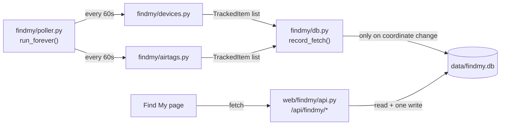
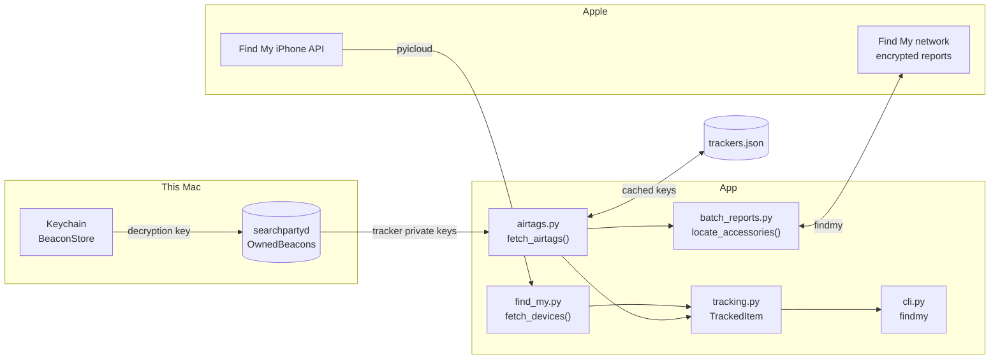

# my-cloud

[](https://github.com/momonala/find-my/actions/workflows/ci.yml)
[](https://codecov.io/gh/momonala/find-my)

Command-line access to Apple's Find My data: locations for iCloud devices and for AirTags, with distance from a
configured home point.

Apple splits this across two unrelated systems, so this project has two backends behind one shared data model:

| Source | Covers | Mechanism |
|--------|--------|-----------|
| `src/findmy/devices.py` | iPhones, iPads, Macs, AirPods | Classic Find My iPhone API — the device reports its own location |
| `src/findmy/airtags.py` | AirTags, Sualio/ACCUTag/Smart Card trackers | Crowdsourced Find My network — nearby Apple devices relay encrypted BLE beacons |

On top of the CLI, `uv run mycloud serve` runs a small web UI and read-only HTTP API backed by a
once-a-minute background poller and a SQLite history. The UI is a shell with a nav bar: a landing page listing
its pages, and Find My as the first of them — see [Serving the web UI and API](#serving-the-web-ui-and-api).

Last Updated: 2026-09-04

## Prerequisites

- Python 3.13 — pinned in `pyproject.toml` as `>=3.13,<3.14` (`cryptography` has no 3.14 wheel yet)
- [uv](https://github.com/astral-sh/uv) for dependency management
- macOS, for the `airtags` command only — it reads keys from this Mac's local Find My data

## Configuration

### Non-Secret Configuration (Version Controlled)

`pyproject.toml` under `[tool.config]`. `home_latitude`/`home_longitude` are the reference point every reported
distance is measured from. Five decimal places is ~1m of latitude, which is all the resolution this needs.

```toml
[tool.config]
home_latitude = 52.49890
home_longitude = 13.40350
```

```bash
uv run config --all
uv run config --home-latitude
```

### Secret Configuration (Git-Ignored)

Copy `.env.example` to `.env`:

```
ICLOUD_USERNAME=you@example.com
ICLOUD_PASSWORD='your-password'
```

Quote the password — `python-dotenv` treats an unquoted `#` as a comment and silently truncates the value.

## Installation

```bash
uv sync
cp .env.example .env
# then edit .env with your Apple ID
```

## Running

One entry point, `findmy`, with a command per source:

```bash
uv run mycloud devices          # iCloud devices only
uv run mycloud airtags          # AirTags and other trackers only
uv run mycloud all              # both, in one table
uv run mycloud refresh-keys     # re-read tracker keys, without locating anything
uv run mycloud serve            # HTTP API + dashboard, backed by an in-process poller
uv run mycloud poll             # just the fetch loop, for --no-poll deployments
```

Shared options — `--sort {name,distance,age}` (default `distance`), `--json` for scripting, and `--refresh-keys` on
the tracker commands:

```bash
uv run mycloud all --sort age
uv run mycloud airtags --json | jq '.[] | select(.distance_m > 100)'
uv run mycloud airtags --refresh-keys    # after pairing a new tracker
```

The first run prompts for a 2FA code and caches the session in `.icloud_session/` (git-ignored), so later runs skip
verification. Output is a table of name, kind, coordinates, distance from home, age in minutes, and last-seen
timestamp — green when seen within the hour, yellow when older, dim when no location is available. Items with no
location always sort last.

```
                                                       AirTags
┏━━━━━━━━━━━━━━━━━━━━┳━━━━━━━━━━━━━━━━━━━━━━━━━┳━━━━━━━━━━━━━━━━━━━━━━┳━━━━━━━━━━┳━━━━━━━━━━━━━┳━━━━━━━━━━━━━━━━━━━━━┓
┃ Name               ┃ Kind                    ┃ Location             ┃ Distance ┃         Age ┃ Last seen           ┃
┡━━━━━━━━━━━━━━━━━━━━╇━━━━━━━━━━━━━━━━━━━━━━━━━╇━━━━━━━━━━━━━━━━━━━━━━╇━━━━━━━━━━╇━━━━━━━━━━━━━╇━━━━━━━━━━━━━━━━━━━━━┩
│ Sunglasses         │ AirTag (2nd generation) │ 52.498943, 13.403543 │      5 m │   8 min ago │ 2026-08-12 11:39:20 │
│ e-bike             │ AirTag (2nd generation) │ 52.498889, 13.403489 │     11 m │ 300 min ago │ 2026-08-12 06:46:50 │
│ Spare keys outside │ Sualio Tag              │ 52.498073, 13.403728 │    103 m │  35 min ago │ 2026-08-12 11:11:50 │
│ Pink Bike          │ ACCUTag                 │ unavailable          │        - │           - │ -                   │
└────────────────────┴─────────────────────────┴──────────────────────┴──────────┴─────────────┴─────────────────────┘
                                                  11 items in 9.1s
```

## Serving the web UI and API

`uv run mycloud serve [--host] [--port] [--poll/--no-poll]` (default `127.0.0.1:5016`, polling on) runs the web
UI and its HTTP API instead of a one-shot CLI command. Reads never make a live Apple call — a background
fetch loop (`src/findmy/poller.py`) runs `fetch_devices()` and `fetch_airtags()` once a minute and writes to a SQLite
file at `data/findmy.db` (git-ignored), and every read route just reads that file. That's what keeps requests
fast: the multi-second Apple round trip (see [Batched report fetching](#batched-report-fetching)) happens on
the poller's own schedule, off the request path. The one write route, `PUT /locations/<id>/icon`, is the
exception — it's a small, validated write straight to SQLite.

Deployments running more than one web worker should pass `--no-poll` and run the fetch loop as its own
process — `uv run mycloud poll` — so exactly one process ever writes to the database; `install/` ships it as a
separate systemd unit for that reason.

`src/findmy/db.py` queries six tables: `devices` (latest name/kind), `location_history` (one row per fix,
written only on coordinate change so repeated identical reports don't grow the table), `device_icons`
(dashboard marker emoji), `alerts` (movement/enter/exit definitions plus `is_active` state, evaluated by
`src/findmy/alerts.py`), `alert_events` (one row per actual firing, kept separate so config and trigger
history don't share a row), and `tracker_alignment` (where each tracker is in its rolling-key rotation — see
[Key caching](#key-caching)). Opening the database and migrating it is `src/core/db.py`'s job, not that
module's, so a future page can reuse the connection plumbing without importing Find My's queries. Schema
itself is owned by [Alembic](#schema-migrations).

Routes are namespaced: pages get a path per feature, JSON routes live under `/api/<feature>/`, and what every
page shares stays at the top level. Adding a page can't collide with an existing one.

| Route | Returns |
|-------|---------|
| `GET /` | The landing page — one card per entry in `src/web/nav.py` |
| `GET /findmy` | The Find My dashboard described below (`GET /dashboard` 301s here) |
| `GET /api/config` | Basemap keys and styles, for any page that draws a map |
| `GET /api/tiles/google/<map_type>/<z>/<x>/<y>` | One proxied Google basemap tile (see below) |
| `GET /api/findmy/config` | Home coordinates to center the map on, and whether Telegram alerting is configured |
| `GET /api/findmy/status` | When the poller last completed a fetch cycle |
| `GET /api/findmy/locations` | Latest known fix for every device, including its distance from home |
| `GET /api/findmy/locations/<id>` | Latest known fix for one device (404 if `id` is unknown) |
| `GET /api/findmy/locations/<id>/history` | That device's fixes, newest first; `?since=<ISO8601>` and `?limit=<N>` filter it |
| `PUT /api/findmy/locations/<id>/icon` | Sets (`{"emoji": "🚲"}`) or clears (`{"emoji": null}`) a device's marker emoji |
| `GET /api/findmy/alerts` | List configured movement/enter/exit alerts (see [Observability](#observability) for how they fire) |
| `POST /api/findmy/alerts` | Create an alert: `{"device_id", "alert_type": "movement"\|"enter"\|"exit", "threshold_m", "anchor": "home"\|"current"}` |
| `PUT /api/findmy/alerts/<id>` | Update an existing alert's type/threshold/anchor |

The write routes are open by default, which is fine for the localhost interface `serve` binds to. Set
`API_WRITE_TOKEN` in `.env` before exposing the dashboard on a network or through a tunnel — writes then
require an `X-Api-Token` header matching it; reads stay open either way.

Devices are identified by Apple's own stable ID — `device.data["id"]` for iCloud devices, `accessory.identifier`
(or a hash of its master key, for third-party tags where Apple leaves that field empty) for trackers — so an
`id` survives a rename in the Find My app.

`GET /findmy` (`src/web/findmy/`) is a plain client-side page calling the JSON routes above — no build step,
no framework, just ES modules and one stylesheet on top of the shell's. A device list (checkbox to show/hide, "Only" to
isolate one) sits next to a [Leaflet](https://leafletjs.com/)/OpenStreetMap map with a time-range filter (1h /
6h / 24h / 7d / all) so a long-running poller's history doesn't overwhelm it. It loads Leaflet and map tiles
from CDNs, so it needs internet access.

The style picker offers free CARTO/OSM rasters by default. Two optional keys add more: `MAPTILER_API_KEY`
(sent to the browser, tiles fetched direct) and `GOOGLE_MAPS_API_KEY` for Google's Map Tiles API. Google's
tiles can't be fetched direct — each needs a server-minted session token and is billed per request — so
`src/maps/google_tiles.py` caches the token and `GET /api/tiles/google/<map_type>/<z>/<x>/<y>` proxies the image,
keeping the billable key server-side. Downloads are cached to `data/google_tiles/` (joblib) and pruned at
30 days on boot, so the cache survives restarts and is shared across browsers; the response also carries a
30-day `Cache-Control` so a warm browser skips the proxy hop entirely. Google's free allowance is 100k tile
requests/month and a dashboard centred on one home area converges on a few hundred tiles, so cache hits are
what keep it free. Which styles exist is the server's call — `GET /api/config` reports `google_map_types` and
the page renders whatever it's given. The route is shell-level rather than Find My's, since any page with a
map wants the same basemaps. `google_tiles_downloaded` vs `google_tiles_served` is the hit rate.



`serve` itself never triggers the one-time 2FA/Keychain prompt (see [Running](#running)) — run `uv run mycloud
airtags`/`devices` at the console first, or the dashboard comes up empty until that cache exists. If a session
expires later, the poller logs a warning each cycle and backs off (up to 15 minutes) rather than retrying at
full speed; re-run the same console command to refresh it.

### Schema migrations

Schema changes go through [Alembic](https://alembic.sqlalchemy.org/) (`migrations/`), not hand-edited DDL in
`src/core/db.py`. `init_db()` runs `alembic upgrade head` on every `mycloud serve`/`mycloud poll` boot, so a normal
code deploy (`deploy.py code pull` + service restart) picks up new migrations automatically — there's no
separate migration step to remember. Applying an already-current schema is a no-op, so this is safe to run on
every boot, including a crash-loop restart.

To add a schema change: `uv run alembic revision -m "add whatever column"`, then hand-write the `upgrade()` (and,
where practical, `downgrade()`) using `op.execute("...")` with raw SQL — there are no SQLAlchemy ORM models in
this project, so `--autogenerate` has nothing to diff against. `uv run alembic upgrade head` applies it against
`data/findmy.db` directly if you want to check it without booting the app.

## Observability

This service reports its own operational metrics and logs to a [Spyglass](https://github.com/momonala/spyglass)
server (see `src/core/telemetry.py`), separate from the location data it tracks about *your own* devices.
`src/core/telemetry.py` is imported once per process entry point (`web/app.py`, `findmy/poller.py`) — each import calls
`spyglass.initialize()` exactly once, which attaches a log-shipping handler to the root logger and creates the
shared `metrics` collector; every module in that process gets remote log shipping for free via propagation, and
imports `metrics` from `src.telemetry` when it needs to emit a counter or timing. Don't call `initialize()` a
second time within the same process — it isn't idempotent and would attach a duplicate log handler.

Metrics emitted (stat names auto-prefixed `my-cloud.{function}.*`):

| Stat | Where | Meaning |
|------|-------|---------|
| `_poll_once.duration` | `poller.py` | Full poll-cycle latency (both fetches plus the DB write) |
| `run_forever.failure` / `consecutive_failures` | `poller.py` | Poll-cycle failure count and the live backoff streak |
| `check_alerts.movement_triggered` | `alerts.py` | A device moved past its configured threshold (cooldown-gated) |
| `check_alerts.enter_triggered` / `exit_triggered` | `alerts.py` | A device crossed into/out of a radius (edge-triggered, cooldown-gated) |
| `_notify.telegram_failed` | `alerts.py` | An in-app alert fired but the Telegram push failed |

## Project Structure

Three layers, and the dependency arrow only ever points inward: `web/` imports `findmy/` and `core/`,
`findmy/` imports `core/`, and `core/` imports nothing of its own. A feature owns its domain code, its
routes, and its assets; the shell owns only what every page shares.

```
my-cloud/
├── src/
│   ├── cli.py                    # `findmy` entry point: commands, sorting, output
│   ├── core/                     # infrastructure, no domain knowledge
│   │   ├── paths.py              # repo root, data/, .icloud_session/ — resolved once
│   │   ├── config.py             # non-secret config from pyproject.toml → `config` CLI
│   │   ├── env.py                # secrets from .env
│   │   ├── db.py                 # opening data/findmy.db and migrating it; no queries
│   │   ├── errors.py             # domain exceptions raised by the fetch layer
│   │   └── telemetry.py          # Spyglass wiring: logging + metrics, see Observability
│   ├── findmy/                   # the tracking domain (`findmy` unqualified is the library)
│   │   ├── devices.py            # iCloud devices via pyicloud → fetch_devices()
│   │   ├── airtags.py            # trackers via findmy         → fetch_airtags()
│   │   ├── batch_reports.py      # batched Apple report fetching, used by airtags.py
│   │   ├── tracking.py           # shared model, distance, sorting, table renderer
│   │   ├── db.py                 # queries over the five find-my tables
│   │   ├── poller.py             # background fetch loop for `mycloud serve`/`mycloud poll`
│   │   ├── alerts.py             # movement/enter/exit alert evaluation, called from poller.py
│   │   └── telegram.py           # alert delivery
│   ├── maps/google_tiles.py      # session-minting + disk-cached Google basemap tiles
│   └── web/
│       ├── app.py                # the app factory: shell routes + blueprint registration
│       ├── nav.py                # the page registry the nav and landing page render
│       ├── auth.py               # the write token every feature's write routes share
│       ├── tiles.py              # /api/tiles/* — the basemap proxy's HTTP surface
│       ├── templates/            # base.html, home.html, _icons.html
│       ├── static/               # tokens.css, shell.css, and the shared JS modules
│       └── findmy/               # one feature: page + JSON routes + its own assets
│           ├── pages.py          # GET /findmy
│           ├── api.py            # /api/findmy/*
│           ├── schemas.py        # request parsing and response shaping
│           ├── templates/findmy/dashboard.html
│           └── static/findmy.css, dashboard.js
├── tests/
├── migrations/               # Alembic schema migrations for data/findmy.db, see Schema migrations
├── alembic.ini
├── pyproject.toml            # dependencies, [tool.config], CLI entry points
└── install/, deploy.py       # systemd units and the pi-cloud deploy CLI
```

### Adding a page

Four things, and nothing else in the shell changes:

1. `src/web/<feature>/` with a `pages.py` blueprint (its own `url_prefix`, `template_folder` and
   `static_folder`) and, if it needs one, an `api.py` blueprint under `/api/<feature>`.
2. A template that `` and fills the `title`, `head`, `content` and `scripts`
   blocks; the view passes `active_page=<slug>` so the nav marks it current.
3. An entry in `src/web/nav.py`, plus its icon in `src/web/templates/_icons.html`.
4. `app.register_blueprint(...)` in `src/web/app.py`.

Shared chrome comes for free: the nav, the banner stack, `tokens.css`/`shell.css`, and the JS modules under
`static/` (`banners.js`, `dialogs.js`, `format.js`, `http.js`, `motion.js`). Anything only one page uses
belongs in that page's own folder — that boundary is the point of the split.

## Architecture

Each backend exposes a fetch function returning `list[TrackedItem]`, so callers treat them interchangeably:
`fetch_devices()` in `src/findmy/devices.py`, `fetch_airtags()` in `src/findmy/airtags.py`. Neither knows about
output — that is `src/cli.py`, which is why `mycloud all` can concatenate both and render one table.
`fetch_airtags()` delegates the actual network round trips to `src/findmy/batch_reports.py` — see [Batched report fetching](#batched-report-fetching).

`src/findmy/tracking.py` owns everything shared: the `TrackedItem`/`Location` model, the haversine distance, the age
calculation, sorting, JSON serialization, the table renderer, and the credential guard. Location is all-or-nothing —
an item either has a full fix (coordinates plus timestamp) or `location is None`, so "unavailable" can't be
half-represented.



### Key caching

Tracker keys are fixed when a tracker is paired, so `src/findmy/airtags.py` caches them in
`.icloud_session/trackers.json` (mode 400) and only touches the Keychain on first run or with `--refresh-keys`.
That file is read-only on every other path, including the poller's — `--refresh-keys` is the one thing that
rewrites it, and it stages to a temp file and renames, so an interrupted write can't leave a half-file where the
master keys were.

Each tracker's rolling-key *alignment* — the index of its most recent report, which locating advances in place —
does change every cycle, so it lives in the `tracker_alignment` table instead. Without it, an accessory falls back
to its pairing date and rescans weeks of keys on every run. It is only a cache: a missing row falls back to
whatever `trackers.json` carries, and a database error is logged and skipped rather than failing the lookup, since
`mycloud airtags`/`mycloud all` locate without opening a database at all.

**Tradeoff:** this writes tracker master keys to plaintext on disk. Anyone with that file can locate those trackers
indefinitely. It stays inside the git-ignored session directory at mode 400; delete it to fall back to the
Keychain. They are deliberately kept out of `data/findmy.db`, which the R2 and git backup jobs sweep up — git
history is append-only, and a master key is fixed at pairing, so a leaked one cannot be rotated.

### Moving to another Mac

Tracker keys are fixed at pairing, not tied to a specific Mac, so copying `.icloud_session/` (whole directory —
`trackers.json`, `findmy_account.json`, `ani_libs.bin`, and the `pyicloud` cookiejar) to a new machine keeps it
working without re-pairing:

```bash
scp -r .icloud_session/ new-mac:/path/to/my-cloud/.icloud_session/
chmod 600 .icloud_session/trackers.json   # scp doesn't always preserve mode 600
uv run mycloud airtags
```

A Mac that never paired these trackers has no local `OwnedBeacons/` record for them, so without this file
`--refresh-keys` on the new machine comes back empty. If the account session is rejected and demands 2FA,
delete only `findmy_account.json` and `ani_libs.bin` and re-authenticate — keep `trackers.json`, which the new
Mac cannot regenerate on its own.

### Batched report fetching

`findmy`'s own `fetch_location()` queries one accessory at a time and walks its rolling keys back until it finds a
report, costing one HTTP request (and one Anisette header generation) per 290 keys. `src/findmy/batch_reports.py`
exploits that Apple's reports endpoint accepts a *list* of key groups per request, with the 290-key cap applying per
group rather than per request: a cheap first-round probe of everyone's newest keys, then one batched sweep for
whoever stayed silent. On 11 trackers this cut ~27 requests to 3 and wall clock from 14.1s to 9.1s.

That reaches past `findmy`'s public API into `fetch_raw_reports`, `LocationReport.decrypt`, and
`FindMyAccessory.update_alignment`, so `findmy` is pinned to an exact version and `tests/test_batch_reports.py` checks
the chunking and attribution logic against stubs.

Concurrency does not help here — every request needs fresh Anisette headers from an emulated ARM library that is
effectively single-threaded, so parallel lookups degrade rather than speed up. The remaining cost — about 5.4s of
the 9.1s — is single-threaded rolling-key derivation, not network time.

### Why RAM saw-tooths, and why the Anisette VM is recycled

Expect memory to climb by a few MB per hour and then drop back — repeatedly, forever. That saw-tooth is deliberate;
the underlying growth is not, and it is not a leak in this codebase (the Python heap is flat).

Every Anisette header generation re-enters the emulated ARM library and appends ~40–50 kB to Unicorn's JIT
translation buffer, which QEMU only reclaims when its 1 GiB region flushes. One header goes out per request to
Apple, so a process that keeps one VM alive grows ~69 MB/day without bound. `anisette` ships a mitigation that
restarts the VM when a guest allocator passes 50%, but guest-allocator utilisation sits near 0.1% under this
workload, so it never fires.

`_get_anisette_provider` in `src/findmy/airtags.py` therefore recycles the VM every `_ANISETTE_MAX_USES` generations,
capping the buffer at ~10 MB. Two details in that function are load-bearing: the VM is released explicitly rather
than left to the garbage collector, and the cyclic collector is invoked by hand. Dropping either doesn't merely fail
to help — discarded VMs accumulate and memory use ends up *worse* than leaving it alone.

Because that fix depends on `findmy` internals, `install/projects_my-cloud.service` also sets `MemoryMax=300M` with
`Restart=always` as a backstop: if an upstream change ever stops the recycling working, the failure mode is
accumulating VMs rather than a crash, and the ceiling turns that into a restart instead of a slow march up the
host's RAM. Hitting it means the recycling needs looking at, not that the limit is too low.

The same emulation is also why this service burns ~12% of a core continuously despite polling once a minute. Both
costs scale directly with `POLL_INTERVAL_SECONDS` (`src/findmy/poller.py`), so raising the interval is the cheapest lever on
either.

### Why two libraries

`pyicloud` cannot see AirTags at all — they have no network connection, so their location only exists as
crowdsourced reports encrypted to each tracker's public key. Decrypting those needs the tracker's *private* key,
which lives in `~/Library/com.apple.icloud.searchpartyd/OwnedBeacons/` on a Mac that paired it, so `findmy` handles
that path. Note the `pyicloud` package on PyPI is the actively maintained [timlaing
fork](https://github.com/timlaing/pyicloud); the original `picklepete/pyicloud` last saw a commit in October 2024.

## Development

```bash
./test-and-lint.sh   # pytest, black --check, ruff check
```

Tests cover `src/core/config.py`, the pure functions in `src/findmy/tracking.py` (distance, age), the
chunking/attribution logic in `src/findmy/batch_reports.py` against stubs, `src/findmy/db.py`'s
change-detection and lookups against a temp SQLite file, and every route — the shell's and Find My's — via
Flask's test client (`create_app(start_poller=False)`, so tests never touch the network). The network-facing fetch paths (`fetch_devices`, `fetch_airtags`, and the poller that calls
them) are not covered — they need a live Apple session.
