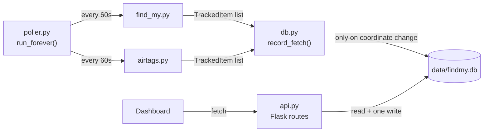
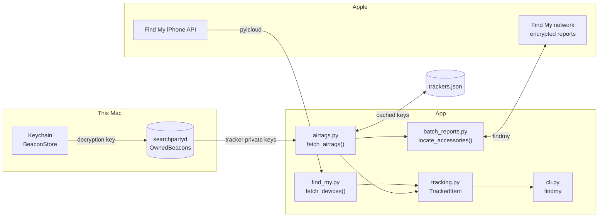

# test-find-my

[](https://github.com/momonala/test-find-my/actions/workflows/ci.yml)
[](https://codecov.io/gh/momonala/test-find-my)

Command-line access to Apple's Find My data: locations for iCloud devices and for AirTags, with distance from a
configured home point.

Apple splits this across two unrelated systems, so this project has two backends behind one shared data model:

| Source | Covers | Mechanism |
|--------|--------|-----------|
| `src/find_my.py` | iPhones, iPads, Macs, AirPods | Classic Find My iPhone API — the device reports its own location |
| `src/airtags.py` | AirTags, Sualio/ACCUTag/Smart Card trackers | Crowdsourced Find My network — nearby Apple devices relay encrypted BLE beacons |

On top of the CLI, `uv run findmy serve` runs a small read-only HTTP API and dashboard backed by a
once-a-minute background poller and a SQLite history — see [Serving an HTTP API and
dashboard](#serving-an-http-api-and-dashboard).

Last Updated: 2026-08-12

## Prerequisites

- Python 3.13 — pinned in `pyproject.toml` as `>=3.13,<3.14`, see [Quirks](#quirks)
- [uv](https://github.com/astral-sh/uv) for dependency management
- macOS, for the `airtags` command only — it reads keys from this Mac's local Find My data

## Installation

```bash
uv sync
cp .env.example .env
# then edit .env with your Apple ID
```

## Configuration

### Non-Secret Configuration (Version Controlled)

`pyproject.toml` under `[tool.config]`. `home_latitude`/`home_longitude` are the reference point every reported
distance is measured from. Five decimal places is ~1m of latitude, which is all the resolution this needs.

```toml
[tool.config]
home_latitude = 52.49890
home_longitude = 13.40350
```

```bash
uv run config --all
uv run config --home-latitude
```

### Secret Configuration (Git-Ignored)

Copy `.env.example` to `.env`:

```
ICLOUD_USERNAME=you@example.com
ICLOUD_PASSWORD='your-password'
```

Quote the password — `python-dotenv` treats an unquoted `#` as a comment and silently truncates the value.

## Running

One entry point, `findmy`, with a command per source:

```bash
uv run findmy devices          # iCloud devices only
uv run findmy airtags          # AirTags and other trackers only
uv run findmy all              # both, in one table
uv run findmy refresh-keys     # re-read tracker keys, without locating anything
uv run findmy serve            # HTTP API + dashboard, backed by an in-process poller
uv run findmy poll             # just the fetch loop, for --no-poll deployments
```

Shared options — `--sort {name,distance,age}` (default `distance`), `--json` for scripting, and `--refresh-keys` on
the tracker commands:

```bash
uv run findmy all --sort age
uv run findmy airtags --json | jq '.[] | select(.distance_m > 100)'
uv run findmy airtags --refresh-keys    # after pairing a new tracker
```

The first run prompts for a 2FA code and caches the session in `.icloud_session/` (git-ignored), so later runs skip
verification. Output is a table of name, kind, coordinates, distance from home, age in minutes, and last-seen
timestamp — green when seen within the hour, yellow when older, dim when no location is available. Items with no
location always sort last.

```
                                                       AirTags
┏━━━━━━━━━━━━━━━━━━━━┳━━━━━━━━━━━━━━━━━━━━━━━━━┳━━━━━━━━━━━━━━━━━━━━━━┳━━━━━━━━━━┳━━━━━━━━━━━━━┳━━━━━━━━━━━━━━━━━━━━━┓
┃ Name               ┃ Kind                    ┃ Location             ┃ Distance ┃         Age ┃ Last seen           ┃
┡━━━━━━━━━━━━━━━━━━━━╇━━━━━━━━━━━━━━━━━━━━━━━━━╇━━━━━━━━━━━━━━━━━━━━━━╇━━━━━━━━━━╇━━━━━━━━━━━━━╇━━━━━━━━━━━━━━━━━━━━━┩
│ Sunglasses         │ AirTag (2nd generation) │ 52.498943, 13.403543 │      5 m │   8 min ago │ 2026-08-12 11:39:20 │
│ e-bike             │ AirTag (2nd generation) │ 52.498889, 13.403489 │     11 m │ 300 min ago │ 2026-08-12 06:46:50 │
│ Spare keys outside │ Sualio Tag              │ 52.498073, 13.403728 │    103 m │  35 min ago │ 2026-08-12 11:11:50 │
│ Pink Bike          │ ACCUTag                 │ unavailable          │        - │           - │ -                   │
└────────────────────┴─────────────────────────┴──────────────────────┴──────────┴─────────────┴─────────────────────┘
                                                  11 items in 9.1s
```

## Serving an HTTP API and dashboard

`uv run findmy serve [--host] [--port] [--poll/--no-poll]` (default `127.0.0.1:5016`, polling on) runs a small
HTTP API and dashboard instead of a one-shot CLI command. Reads never make a live Apple call — a background
fetch loop (`src/poller.py`) runs `fetch_devices()` and `fetch_airtags()` once a minute and writes to a SQLite
file at `data/findmy.db` (git-ignored), and every read route just reads that file. That's what keeps requests
fast: the multi-second Apple round trip (see [Batched report fetching](#batched-report-fetching)) happens on
the poller's own schedule, off the request path. The one write route, `PUT /locations/<id>/icon`, is the
exception — it's a small, validated write straight to SQLite.

Deployments running more than one web worker should pass `--no-poll` and run the fetch loop as its own
process — `uv run findmy poll` — so exactly one process ever writes to the database; `install/` ships it as a
separate systemd unit for that reason.

`src/db.py` keeps four tables: `devices` (latest name/kind per device), `location_history` (one row per fix —
only written when coordinates actually change from the last stored fix, so repeated identical reports from
Apple's network don't grow the table), `device_icons` (the marker emoji set via the dashboard), and `alerts`
(user-configured movement/enter/exit alerts, evaluated by `src/alerts.py` from the poller — `enter`/`exit`
alerts measure from home by default, or from a fixed point snapshotted at creation time if the dashboard's
"Measured from: Current location" option was used). Schema itself is owned by
[Alembic](#schema-migrations), not `db.py` directly.

| Route | Returns |
|-------|---------|
| `GET /` | Redirects to `/dashboard` |
| `GET /dashboard` | The HTML dashboard described below |
| `GET /config` | Home coordinates, for the dashboard to center the map |
| `GET /status` | When the poller last completed a fetch cycle |
| `GET /locations` | Latest known fix for every device, including its distance from home |
| `GET /locations/<id>` | Latest known fix for one device (404 if `id` is unknown) |
| `GET /locations/<id>/history` | That device's fixes, newest first; `?since=<ISO8601>` and `?limit=<N>` filter it |
| `PUT /locations/<id>/icon` | Sets (`{"emoji": "🚲"}`) or clears (`{"emoji": null}`) a device's marker emoji |

The write route is open by default, which is fine for the localhost interface `serve` binds to. Set
`API_WRITE_TOKEN` in `.env` before exposing the dashboard on a network or through a tunnel — writes then
require an `X-Api-Token` header matching it; reads stay open either way.

Devices are identified by Apple's own stable ID — `device.data["id"]` for iCloud devices, `accessory.identifier`
(or a hash of its master key, for third-party tags where Apple leaves that field empty) for trackers — so an
`id` survives a rename in the Find My app.

`GET /dashboard` serves `src/templates/dashboard.html` plus `src/static/dashboard.{css,js}`: a device list
(checkbox to show/hide, "Only" to isolate one, a color swatch shared with its plotted track) next to a
[Leaflet](https://leafletjs.com/)/OpenStreetMap map plotting whichever devices are checked, with a time-range
filter (last hour / 6 hours / 24 hours / 7 days / all time) so a long-running poller's history doesn't
overwhelm the map. It's a plain client-side page calling the JSON routes above — no build step, no framework —
but it does load Leaflet from unpkg and map tiles from CARTO, so it needs internet access and won't work fully
offline.



Because the poller reuses whatever's cached in `.icloud_session/`, first run `uv run findmy airtags` (and/or
`devices`) at the console to get past the one-time 2FA/Keychain prompts — `serve` itself never triggers them
and will just come up with an empty dashboard until that cache exists. If a session expires later, the poller
logs a warning each cycle and backs off (up to 15 minutes between attempts) rather than retrying at full
speed forever; re-run the same console command to refresh it.

### Schema migrations

Schema changes go through [Alembic](https://alembic.sqlalchemy.org/) (`migrations/`), not hand-edited DDL in
`src/db.py`. `init_db()` runs `alembic upgrade head` on every `findmy serve`/`findmy poll` boot, so a normal
code deploy (`deploy.py code pull` + service restart) picks up new migrations automatically — there's no
separate migration step to remember. Applying an already-current schema is a no-op, so this is safe to run on
every boot, including a crash-loop restart.

To add a schema change: `uv run alembic revision -m "add whatever column"`, then hand-write the `upgrade()` (and,
where practical, `downgrade()`) using `op.execute("...")` with raw SQL — there are no SQLAlchemy ORM models in
this project, so `--autogenerate` has nothing to diff against. `uv run alembic upgrade head` applies it against
`data/findmy.db` directly if you want to check it without booting the app.

## Observability

This service reports its own operational metrics and logs to a [Spyglass](https://github.com/momonala/spyglass)
server (see `src/telemetry.py`), separate from the location data it tracks about *your own* devices.
`src/telemetry.py` is imported once per process entry point (`api.py`, `poller.py`) — each import calls
`spyglass.initialize()` exactly once, which attaches a log-shipping handler to the root logger and creates the
shared `metrics` collector; every module in that process gets remote log shipping for free via propagation, and
imports `metrics` from `src.telemetry` when it needs to emit a counter or timing. Don't call `initialize()` a
second time within the same process — it isn't idempotent and would attach a duplicate log handler.

Metrics emitted (stat names auto-prefixed `find-my.{function}.*`):

| Stat | Where | Meaning |
|------|-------|---------|
| `_poll_once.duration` | `poller.py` | Full poll-cycle latency (both fetches plus the DB write) |
| `run_forever.failure` / `consecutive_failures` | `poller.py` | Poll-cycle failure count and the live backoff streak |
| `check_alerts.movement_triggered` | `alerts.py` | A device moved past its configured threshold (cooldown-gated) |
| `check_alerts.enter_triggered` / `exit_triggered` | `alerts.py` | A device crossed into/out of a radius (edge-triggered, cooldown-gated) |
| `_notify.telegram_failed` | `alerts.py` | An in-app alert fired but the Telegram push failed |

## Architecture

Each backend exposes a fetch function returning `list[TrackedItem]`, so callers treat them interchangeably:
`fetch_devices()` in `src/find_my.py`, `fetch_airtags()` in `src/airtags.py`. Neither knows about output — that is
`src/cli.py`, which is why `findmy all` can concatenate both and render one table. `fetch_airtags()` delegates the
actual network round trips to `src/batch_reports.py` — see [Batched report fetching](#batched-report-fetching).

`src/tracking.py` owns everything shared: the `TrackedItem`/`Location` model, the haversine distance, the age
calculation, sorting, JSON serialization, the table renderer, and the credential guard. Location is all-or-nothing —
an item either has a full fix (coordinates plus timestamp) or `location is None`, so "unavailable" can't be
half-represented.



### Key caching

Tracker keys are fixed when a tracker is paired, so `src/airtags.py` caches them in
`.icloud_session/trackers.json` (chmod 600) and only touches the Keychain on first run or with `--refresh-keys`. The
cache also stores each tracker's rolling-key *alignment* — the index of its most recent report — which
`fetch_location()` advances in place. Without that, an accessory whose local record has no `KeyAlignmentRecord` falls
back to its pairing date and rescans weeks of keys on every run.

**Tradeoff:** this writes tracker master keys to plaintext on disk. Anyone with that file can locate those trackers
indefinitely. It stays inside the git-ignored session directory at mode 600; delete it to fall back to the Keychain.

### Moving to another Mac

Tracker keys are fixed at pairing, not tied to a specific Mac, so `.icloud_session/trackers.json` can be copied to a
new machine and keeps working. This matters more than it sounds: a Mac that never paired these trackers itself has no
`OwnedBeacons/` records for them, so without this file `--refresh-keys` on the new machine would come back empty.

```bash
scp -r .icloud_session/ new-mac:/path/to/test-find-my/.icloud_session/
chmod 600 .icloud_session/trackers.json   # scp doesn't always preserve mode 600
uv run findmy airtags
```

That copies the whole session — `trackers.json` (tracker keys), `findmy_account.json` + `ani_libs.bin` (the `findmy`
Apple-account session and its Anisette provisioning state), and the `pyicloud` session/cookiejar. If the account
session is rejected on the new Mac and it demands 2FA, delete only `findmy_account.json` and `ani_libs.bin` and let it
re-authenticate — keep `trackers.json`, since it's independent of the login session and is the one file the new Mac
cannot regenerate on its own.

### Batched report fetching

`findmy`'s own `fetch_location()` queries one accessory at a time and walks its rolling keys back until it finds a
report, costing one HTTP request (and one Anisette header generation) per 290 keys. `src/batch_reports.py`
exploits that Apple's reports endpoint accepts a *list* of key groups per request, with the 290-key cap applying per
group rather than per request: a cheap first-round probe of everyone's newest keys, then one batched sweep for
whoever stayed silent. On 11 trackers this cut ~27 requests to 3 and wall clock from 14.1s to 9.1s.

That reaches past `findmy`'s public API into `fetch_raw_reports`, `LocationReport.decrypt`, and
`FindMyAccessory.update_alignment`, so `findmy` is pinned to an exact version and `tests/test_batch_reports.py` checks
the chunking and attribution logic against stubs.

Concurrency does not help here (see [Quirks](#quirks)), so the remaining cost — about 5.4s of the 9.1s — is
single-threaded rolling-key derivation, not network time.

### Why two libraries

`pyicloud` cannot see AirTags at all — they have no network connection, so their location only exists as
crowdsourced reports encrypted to each tracker's public key. Decrypting those needs the tracker's *private* key,
which lives in `~/Library/com.apple.icloud.searchpartyd/OwnedBeacons/` on a Mac that paired it, so `findmy` handles
that path. Note the `pyicloud` package on PyPI is the actively maintained [timlaing
fork](https://github.com/timlaing/pyicloud); the original `picklepete/pyicloud` last saw a commit in October 2024.

## Project Structure

```
test-find-my/
├── src/
│   ├── cli.py                    # `findmy` entry point: commands, sorting, output
│   ├── find_my.py                # iCloud devices via pyicloud → fetch_devices()
│   ├── airtags.py                # trackers via findmy         → fetch_airtags()
│   ├── batch_reports.py          # batched Apple report fetching, used by airtags.py
│   ├── tracking.py               # shared model, distance, sorting, table renderer
│   ├── errors.py                 # domain exceptions raised by the fetch layer
│   ├── poller.py                 # background fetch loop for `findmy serve`/`findmy poll`
│   ├── db.py                     # SQLite queries backing the API; schema lives in migrations/
│   ├── alerts.py                 # movement/enter/exit alert evaluation, called from poller.py
│   ├── api.py                    # Flask app: JSON routes + /dashboard
│   ├── templates/dashboard.html
│   ├── static/dashboard.{css,js}
│   ├── config.py                 # non-secret config from pyproject.toml → `config` CLI
│   ├── env.py                    # secrets from .env
│   └── telemetry.py              # Spyglass wiring: logging + metrics, see Observability
├── tests/
├── migrations/               # Alembic schema migrations for data/findmy.db, see Schema migrations
├── alembic.ini
├── pyproject.toml            # dependencies, [tool.config], CLI entry points
└── install/, deploy.py       # systemd units and the pi-cloud deploy CLI
```

## Quirks

**Python 3.14 breaks `uv sync`.** `cryptography` has no 3.14 wheel yet, so the install falls back to a Rust build that
fails. Hence the `<3.14` bound in `requires-python`; relax it once wheels ship.

**`airtags` needs the Mac's console the first time.** Reading tracker keys raises a GUI Keychain prompt (`security
find-generic-password -l BeaconStore`), which can't be answered over SSH, and only sees trackers paired on that Mac.
Cached keys remove the Keychain dependency on later runs — see [Key caching](#key-caching) and [Moving to another
Mac](#moving-to-another-mac).

**Parallelising `airtags` makes it slower, not faster.** Every request needs fresh Anisette headers from an emulated
ARM library that is effectively single-threaded: uncontended it's ~40ms, but with 5 concurrent lookups it degrades to
~10,000ms each. `src/batch_reports.py` gets the real win instead by cutting the *number* of requests — see [Batched
report fetching](#batched-report-fetching).

**Apple devices are filtered out of `airtags`.** They appear in the local key store too, but `find_my.py` already
covers them via a faster API; the filter keys off model format (`iPhone14,5` vs. `AirTag (2nd generation)`). Use
`findmy all` for both sets together.

**Some trackers report `unknown` as their kind** — their local record has no model name, which is normal for older or
third-party tags.

**`pyicloud` and `findmy` hold separate Apple sessions** and authenticate differently, so each prompts for its own
2FA on first run and caches its own state in `.icloud_session/`. `findmy`'s login is the stricter of the two — if it
rejects a password `pyicloud` accepts, check `.env` quoting first.

## Development

```bash
./test-and-lint.sh   # pytest, black --check, ruff check
```

Tests cover `src/config.py`, the pure functions in `src/tracking.py` (distance, age), the chunking/attribution
logic in `src/batch_reports.py` against stubs, `src/db.py`'s change-detection and lookups against a temp SQLite
file, and every `src/api.py` route via Flask's test client (`create_app(start_poller=False)`, so tests never
touch the network). The network-facing fetch paths (`fetch_devices`, `fetch_airtags`, and the poller that calls
them) are not covered — they need a live Apple session.
